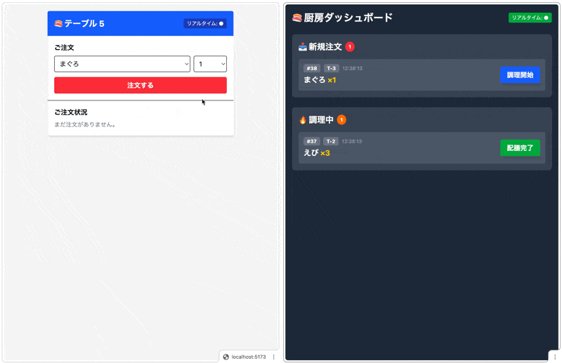

# 🍣 回転寿司オーダーシステム

Hono Advent Calendar 2025 用のサンプルアプリケーション。

イベント駆動アーキテクチャの学習を目的とした、リアルタイム注文管理システムです。



## 技術スタック

- **Runtime**: Deno
- **Web Framework**: Hono
- **Database**: PostgreSQL + Kysely
- **Message Queue**: NATS
- **Frontend**: React + TanStack Query + Tailwind CSS
- **Real-time**: Server-Sent Events (SSE)

## アーキテクチャ

```
┌─────────────┐     ┌─────────────┐
│  Customer   │     │   Kitchen   │
│   Screen    │     │   Screen    │
└──────┬──────┘     └──────┬──────┘
       │                   │
       │    SSE Events     │
       ▼                   ▼
┌──────────────────────────────────┐
│          SSE Server              │◄──── NATS Subscribe
└──────────────────────────────────┘

┌──────────────────────────────────┐
│           API Server             │
│  ┌─────────┐  ┌───────────────┐  │
│  │ Orders  │  │ Event Outbox  │  │
│  └─────────┘  └───────────────┘  │
└──────────────────────────────────┘
         │              │
         │              ▼
         │      ┌───────────────┐
         │      │    Poller     │───► NATS Publish
         │      └───────────────┘
         ▼
┌──────────────────────────────────┐
│           PostgreSQL             │
└──────────────────────────────────┘
```

## セットアップ

### 1. 必要なツール

- [mise](https://mise.jdx.dev/) (Deno バージョン管理)
- [Docker](https://www.docker.com/)

### 2. Deno のインストール

```bash
mise install
```

### 3. インフラの起動

```bash
docker compose up -d
```

### 4. DB マイグレーション

```bash
deno task --filter @app/api migrate
```

### 5. 初期データ投入（オプション）

```bash
deno task --filter @app/api seed
```

### 6. アプリケーション起動

```bash
deno task dev
```

以下が起動します:

- **API Server**: http://localhost:3000
- **Swagger UI**: http://localhost:3000/ui
- **SSE Server**: http://localhost:3001
- **Web (Frontend)**: http://localhost:5173
- **Poller**: バックグラウンドで動作

## 使い方

### 客の画面

http://localhost:5173/customer?table=5

- テーブル番号はクエリパラメータで指定（例: `?table=5`）
- 寿司を選んで「注文する」をクリック
- 注文状況がリアルタイムで更新される

### 厨房の画面

http://localhost:5173/kitchen

- 全テーブルの注文を一覧表示
- 「調理開始」→「配膳完了」で注文を処理
- 新しい注文がリアルタイムで表示される

## コマンド一覧

| コマンド                                   | 説明                          |
| ------------------------------------------ | ----------------------------- |
| `deno task dev`                            | 全アプリを起動                |
| `deno task kill`                           | 使用中のポートを解放          |
| `deno task --filter @app/api migrate`      | マイグレーション実行          |
| `deno task --filter @app/api migrate:down` | マイグレーション巻き戻し      |
| `deno task --filter @app/api seed`         | データリセット＋初期データ    |
| `deno task --filter @app/web generate`     | API クライアント生成（orval） |

## 設計ポイント

### Transactional Outbox パターン

注文の状態更新とイベント記録を同一トランザクションで行い、Poller が非同期で NATS
に配信。信頼性の高いイベント配信を実現。

### OpenAPI / Swagger UI

`@hono/zod-openapi` を使用し、Zod スキーマから OpenAPI
ドキュメントを自動生成。http://localhost:3000/ui で API を確認・テスト可能。

### モノレポ構成

各アプリ（api, poller, sse-server,
web）は独立しており、パッケージ共有なし。シンプルさを優先。

### API クライアント自動生成

orval を使用し、OpenAPI スキーマから React Query 用のフックを自動生成。API
サーバー起動中に `deno task --filter @app/web generate` で再生成可能。

### コードフォーマット

lefthook で pre-commit フックとして `deno fmt` が実行される。

## ライセンス

MIT
